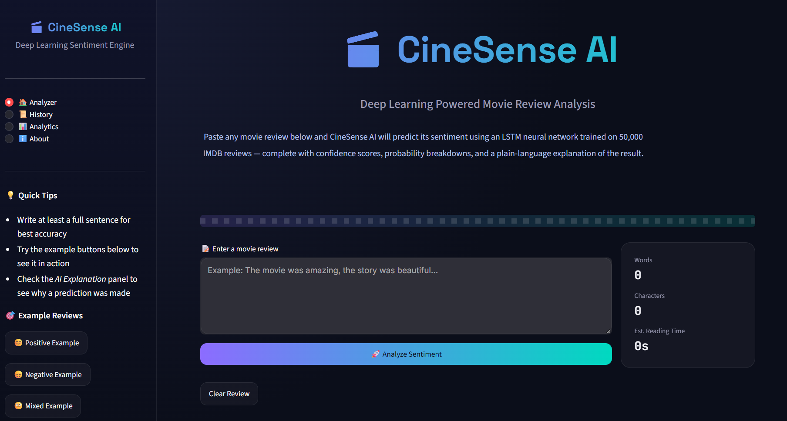
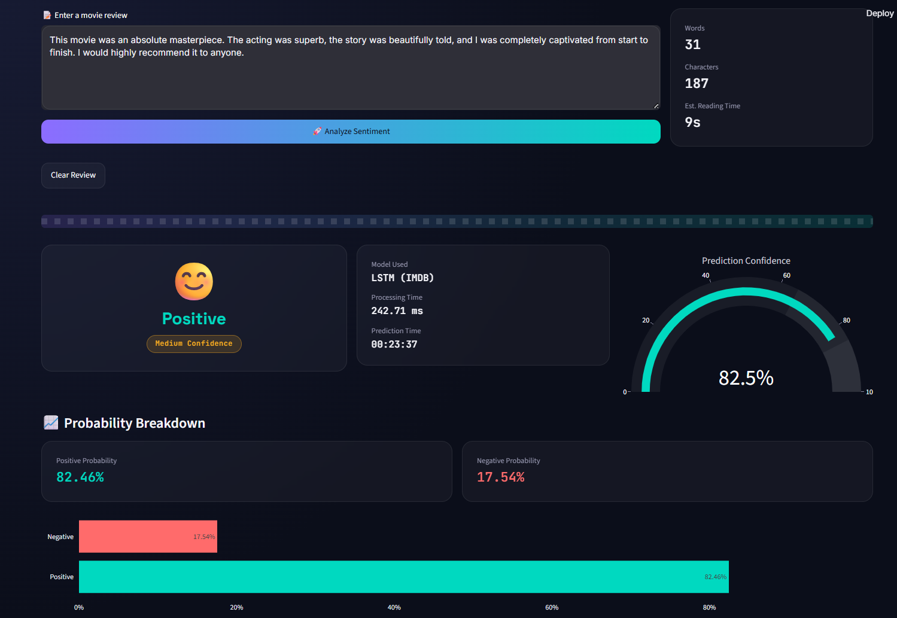
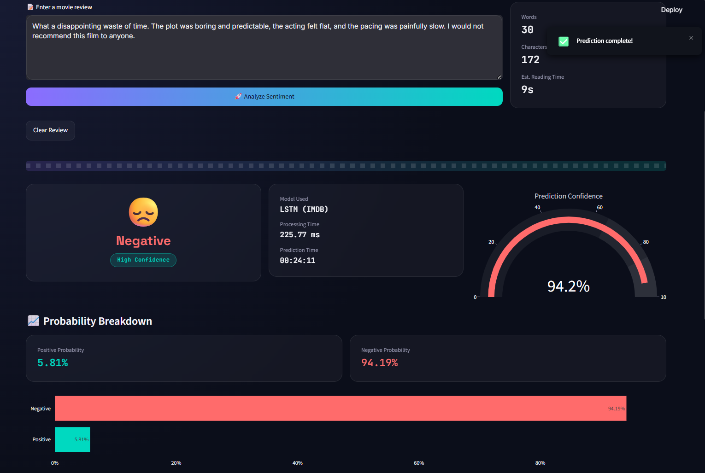
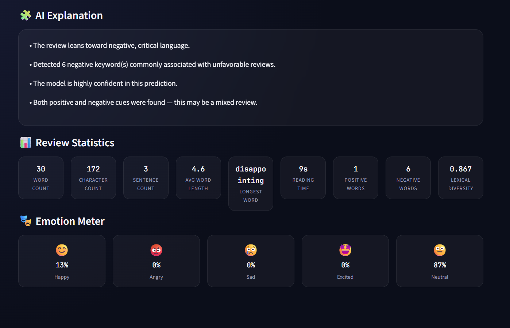
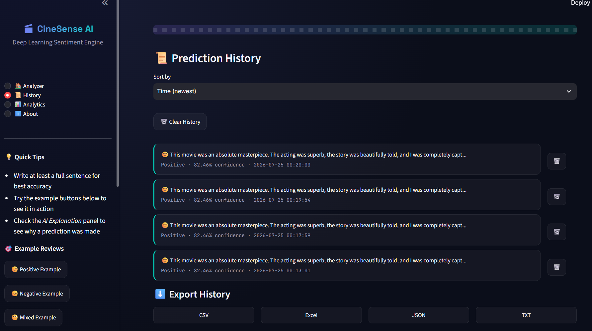
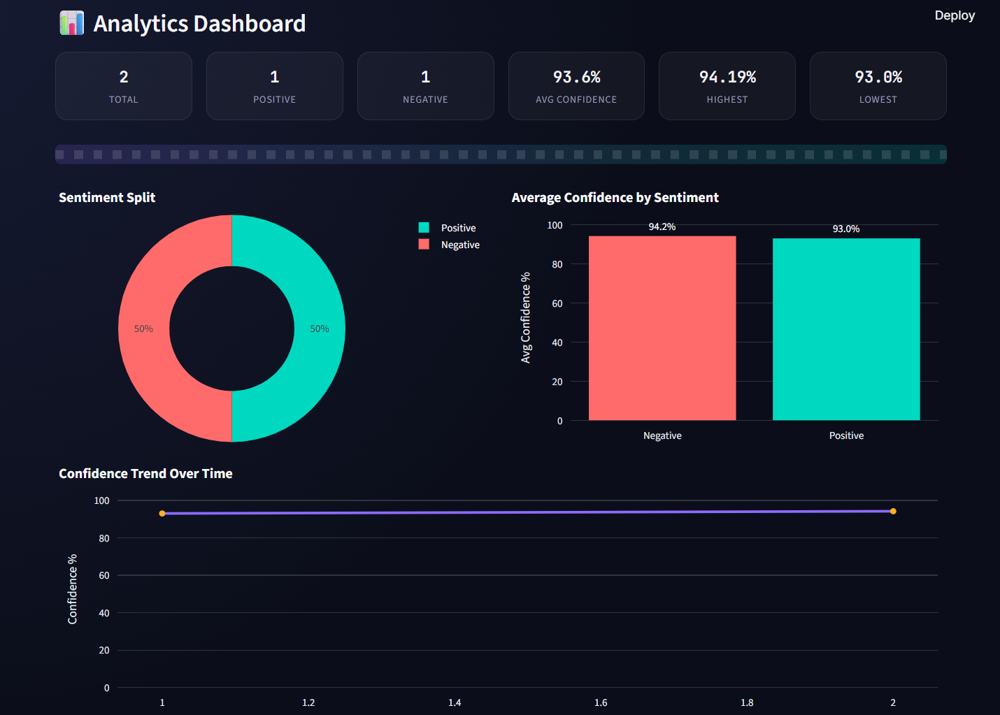

# 🎬 CineSense AI

<div align="center">

## Deep Learning Powered Movie Review Sentiment Analysis

A modern, production-style Streamlit application that predicts movie review sentiment using a Deep Learning LSTM model trained on the IMDB dataset.

Built with a premium UI, interactive analytics, explainable AI, prediction history, and data visualization.


</div>

---

# 📸 Application Preview

## 🏠 Dashboard



The main dashboard allows users to enter movie reviews, view live text statistics, and perform instant sentiment analysis.

---

## 😊 Positive Prediction



Displays:

- Sentiment Card
- Confidence Gauge
- Prediction Details
- Probability Breakdown
- Processing Time

---

## 😞 Negative Prediction



The application accurately identifies negative reviews and visualizes prediction confidence with interactive charts.

---

## 🧠 AI Explanation & Review Statistics



Provides:

- Rule-based AI explanation
- Review statistics
- Lexical diversity
- Reading time
- Emotion Meter

---

## 📜 Prediction History



Features include:

- Prediction history
- Delete entries
- Sort history
- Export as CSV
- Export as Excel
- Export as JSON
- Export as TXT

---

## 📊 Analytics Dashboard



Visualize historical predictions through:

- KPI Cards
- Sentiment Distribution
- Average Confidence
- Confidence Trend
- Interactive Charts

---

# ✨ Features

## 🤖 AI Prediction

- LSTM Deep Learning sentiment classifier
- IMDB dataset (50,000 reviews)
- Confidence score
- Positive/Negative probability breakdown
- Processing time

## 🎨 Premium UI

- Modern glassmorphism design
- Cinema-inspired dark theme
- Responsive layout
- Gradient buttons
- Custom CSS styling
- Animated components

## 📈 Analytics

- Interactive Plotly charts
- Confidence trends
- Sentiment distribution
- Prediction statistics
- KPI dashboard

## 🧠 Explainable AI

- Rule-based explanation engine
- Keyword detection
- Confidence interpretation
- Mixed sentiment detection

## 📝 Review Statistics

- Word count
- Character count
- Sentence count
- Average word length
- Reading time
- Longest word
- Lexical diversity
- Positive keyword count
- Negative keyword count

## 🎭 Emotion Meter

Detects emotional tone including:

- 😊 Happy
- 😡 Angry
- 😢 Sad
- 🤩 Excited
- 😐 Neutral

## 📜 History Management

- Stores prediction history
- Delete individual entries
- Clear history
- Sort by newest or oldest
- Session-based storage

## 📤 Export Options

Export prediction history as:

- CSV
- Excel
- JSON
- TXT

---

# 🛠 Tech Stack

| Category | Technology |
|-----------|------------|
| Language | Python |
| Frontend | Streamlit |
| Deep Learning | TensorFlow / Keras |
| Model | LSTM RNN |
| Visualization | Plotly |
| Data Processing | Pandas |
| Numerical Computing | NumPy |
| Styling | Custom CSS |

---

# 📂 Project Structure

```text
Movie-Sentiment-Analysis
│
├── app.py
├── assets
│   └── style.css
│
├── models
│   └── simple_rnn_imdb.h5
│
├── utils
│   ├── analytics.py
│   ├── prediction.py
│   ├── preprocessing.py
│   └── visualization.py
│
├── screenshots
│   ├── dashboard.png
│   ├── p1.png
│   ├── p2.png
│   ├── explaination.png
│   ├── history.png
│   └── analytics.png
│
├── requirements.txt
└── README.md
```

---

# 🚀 Installation

Clone the repository

```bash
git clone https://github.com/Abraham-John/CineSense-AI.git
```

Navigate into the project

```bash
cd CineSense-AI
```

Install dependencies

```bash
pip install -r requirements.txt
```

Place your trained model inside

```
models/simple_rnn_imdb.h5
```

Run the application

```bash
streamlit run app.py
```

---

# 🧠 Model Details

| Property | Value |
|----------|-------|
| Architecture | LSTM RNN |
| Dataset | IMDB Movie Reviews |
| Reviews | 50,000 |
| Vocabulary Size | 10,000 |
| Max Sequence Length | 500 |
| Output | Binary Sentiment |
| Activation | Sigmoid |

---

# 📌 Notes

- This project focuses on deployment and visualization around a trained LSTM model.
- The original prediction pipeline remains unchanged.
- Prediction history is stored in Streamlit Session State (not a database).
- Built as a portfolio project showcasing Deep Learning, NLP, UI/UX, and Streamlit development.

---

# 👨‍💻 Author

**Abraham John**

GitHub: https://github.com/Abraham-John

If you found this project helpful, consider giving it a ⭐ on GitHub!
